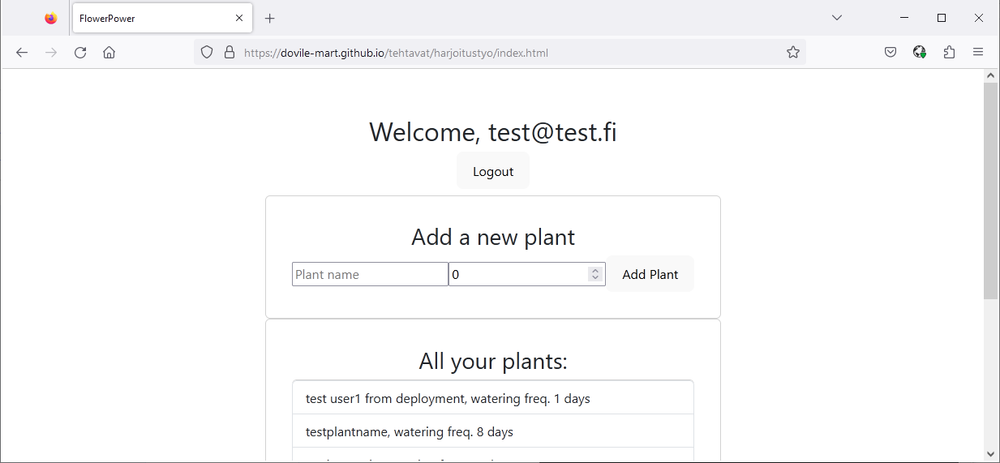
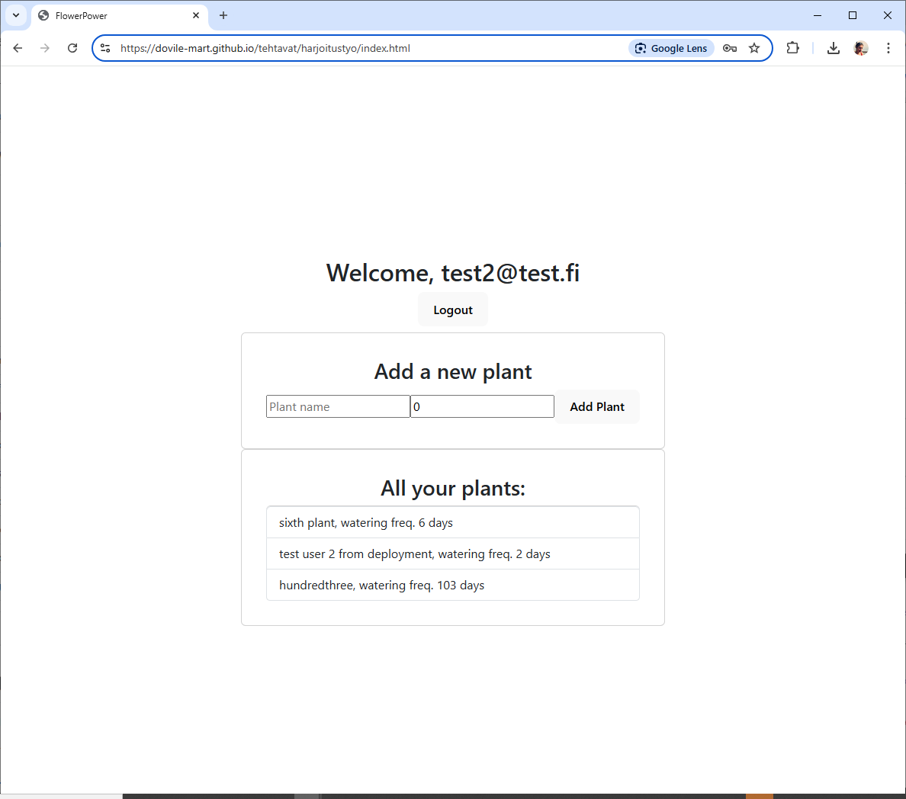
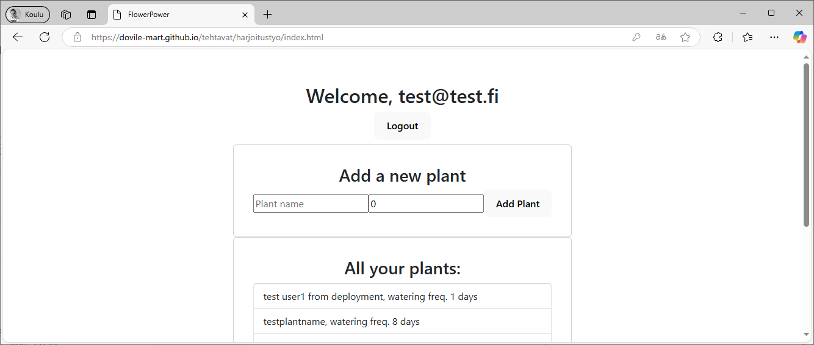
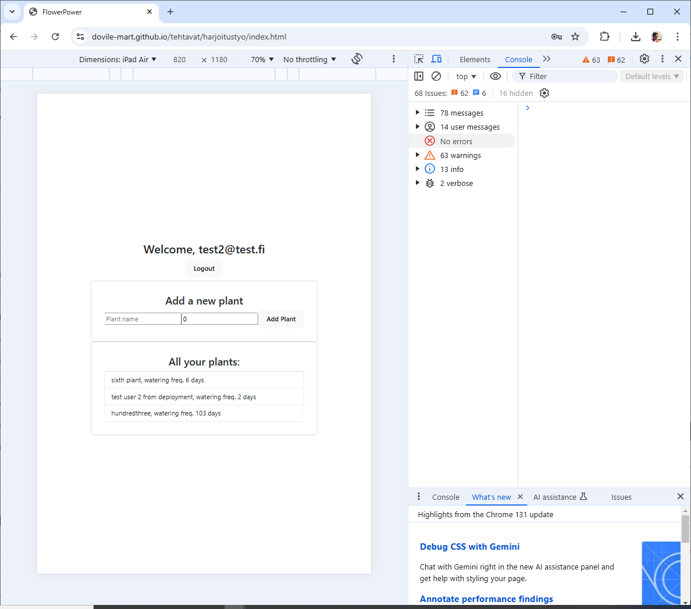
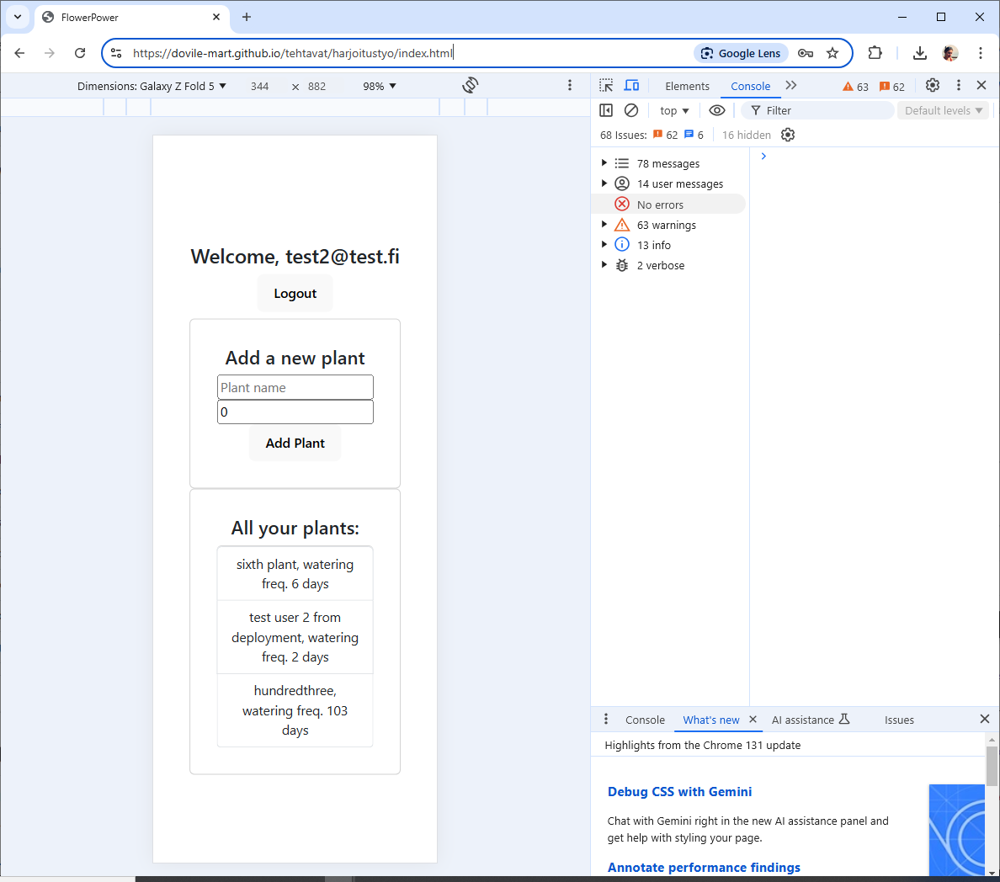

## Harjoitustyö

Harjoitustyössä käyttäjä voi lisätä kasveja ja määrittää niiden kasteluvälit, selata omaa kasvilistaansa sekä hakea kasveja eri kasvisperheistä hyödyntäen avointa dataa. Sovelluksessa käytetään Firebase-autentikaatiota, Firestore-tietokantaa, MUI-kirjastoa sekä Trefle.io-palvelun tarjoamaa avointa dataa. Firebaseen on luotu kaksi esimerkkikäyttäjää, joilla on omat "Plant"-kokoelmat. Näissä kokoelmissa jokaisella käyttäjällä on omat yksilölliset kasvilistansa.

[Linkki harjoitustyön sivulle](https://dovile-mart.github.io/tehtavat/harjoitustyo/index.html), käyttäjät: test@test.fi (testing), test2@test.fi (testing2)

[Linkki projektin repositorioon](https://github.com/dovile-mart/ppw_flower_power)

## Responsiivisuus
Sivusto toimii erinomaisesti eri kokoisilla näytöillä (desktop, tablet, mobiili). Toimivuus on testattu sekä Google Chromen kehittäjätyökalulla että fyysisillä laitteilla. Mobiililaitteilla kaikki toimii suunnitellusti sekä vaaka- että pystysuunnassa.

[//]: 
[//]:
[//]:

[//]:
[//]:

## Toimivuus Uusimmilla Selaimilla
Sivusto on testattu uusimmilla selaimilla ja toimii kaikissa suunnittelusti:

- Google Chrome (Versio 131.0.6778.140).
- Mozilla Firefox (Versio 115.18.0esr).
- Microsoft Edge (Versio 131.0.2903.99).

## Sivujen Latautumisaika
Sivuston latautumisajat on testattu PageSpeed Insights -työkalulla. Ennen MUI-kirjaston lisäämistä latausajat olivat hieman nopeampia, mutta ero ei ollut merkittävä. MUI-kirjaston integrointi on kuitenkin parantanut käyttöliittymän toiminnallisuuksia ja visuaalista ilmettä.  Nopeudet ovat erinomaiset niin [tietokoneella](https://pagespeed.web.dev/analysis/https-dovile-mart-github-io-tehtavat-harjoitustyo-index-html/j07imv9mru?form_factor=desktop) kuin [mobiililaitteilla](https://pagespeed.web.dev/analysis/https-dovile-mart-github-io-tehtavat-harjoitustyo-index-html/j07imv9mru?form_factor=mobile). Testitulokset osoittavat, että sivusto latautuu nopeasti, mikä parantaa käyttökokemusta ja vähentää käyttäjien odotusaikoja.

#### Desktop
- First Contentful Paint (FCP): 0.5 s
- Largest Contentful Paint (LCP): 0.5 s
- Total Blocking Time (TBT): 80 ms
- Cumulative Layout Shift (CLS): 0
- Speed Index: 0.5 s

#### Mobiili 

- First Contentful Paint (FCP): 2.4 s
- Largest Contentful Paint (LCP): 2.4 s
- Total Blocking Time (TBT): 70 ms
- Cumulative Layout Shift (CLS): 0
- Speed Index: 2.4s

