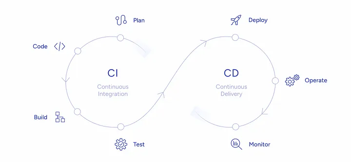

## **Viikko 2**
### Tehtävä 2
<!--TEHTÄVÄ: Kuvaile miten Jekyll sivustoa voisi automatisoida käyttäen GitHub Actions-toimintoja. Vastaa myös millaisilla kehitystyökaluilla ja -tekniikoilla saataisiin CI/CD-putkisto rakennettua web-sovellukselle. Tekstimäärä noin 150 sanaa.
-->

### Jekyll sivuston automatisointi GitHub Actions-toimintoja käyttäen

GitHub Actions -pilvipalvelun avulla voidaan hallita Jekyll-sivuston CI/CD -prosessia (Continuous Integration, Continuous Deployment tai Delivery), jolloin jokaisen repositorioon tehdyn muutoksen yhteydessä automaattisesti käynnistyy työnkulku (workflow), jonka kaikki vaiheet läpikäyden sivusto päivitetään.
Jekyll-sivuston asetuksia varten repositorion juureen lisätään *_config.yml*-tiedosto, jossa määritellään sivuston teema ja lisäosat. Kun halutaan käyttää GitHub Pages sisäänrakennettua Jekyll-työnkulkua, GitHub Actions -toiminto tulee aktivoida repositoriossa.
Työkulku käynnistyy joko `push`-komennolla tai kun `pull request` on hyväksytty ja uudet muutokset yhdistetään päähaaraan.

Työnkulku:
- ***koodin integrointi***: varmistetaan, että kaikki koodimuutokset integroituvat seuraavaan Jekyll-sivuston päivitykseen.
- ***testaus***: varmistetaan, että sivusto rakentuu ilman virheitä.
- ***julkaisu***: Jekyll-sivusto viedään GitHub Pages-ympäristöön.

##### * [GitHub Docs](https://docs.github.com/en/pages/setting-up-a-github-pages-site-with-jekyll/about-github-pages-and-jekyll)
---

### CI/CD-putkiston Web-sovellukselle rakentamisessa käytettävät kehitystyökalut ja -tekniikat

CI/CD-putkiston rakentaminen web-sovellukselle perustuu automaation ja testauksen työkaluihin, jotka tukevat jatkuvaa integrointia (CI) ja jatkuvaa toimittamista (CD). CI/CD-prosessissa DevOps-periaatteet yhdistävät kehityksen ja tuotannon, nopeuttaen julkaisusyklejä ja parantaen ohjelmiston laatua.

*CI työkalut* automatisoivat koodin rakentamisen ja testauksen jokaisen muutoksen yhteydessä, jolloin voidaan havaita virheet aikaisessa vaiheessa. CI-työkalut: Jenkins, Travis CI, Circle CI, GitLab CI/CD.

*CD työkalut* mahdollistavat automatisoidun julkaisuprosessin, jolloin koodimuutokset siirtyvät testausympäristöön tai tuotantoon. Suosituimmat CD-työkalut: Jenkins, Spinnaker.

Konttiteknologiat ja orkestrointi: Docker ja Kubernetes ovat suosittuja työkaluja konttien hallintaan ja orkestrointiin, ja ne integroituvat hyvin CI/CD-putkistoihin.

Näillä työkaluilla rakennettu CI/CD-putkisto mahdollistaa web-sovelluksen säännölliset ja automatisoidut päivitykset, parantaen sen luotettavuutta ja suorituskykyä tuotannossa.
##### * [Lähde 1](https://gartsolutions.medium.com/building-an-effective-ci-cd-pipeline-a-comprehensive-guide-bb07343973b7)
##### * [Lähde 2](https://thectoclub.com/tools/best-ci-cd-tools/)
---
*[<-- Etusivulle](index.md)*